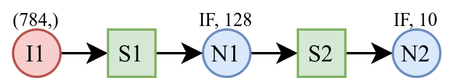

<div align="center">

# PAIBox使用指南

</div>

## 快速上手

PAIBox使用 `pyproject.toml` 管理依赖。若使用Poetry：

```bash
poetry install
```

若使用conda等，则手动安装如下依赖至Python虚拟环境：

```toml
python = "^3.8"
pydantic = "^2.0"
numpy = "^1.23.0"
paicorelib = "^0.0.11"
```

通过pip安装PAIBox：

```bash
pip install paibox
```

或克隆 `dev` 分支以体验开发版。

```bash
git clone -b dev https://github.com/PAICookers/PAIBox.git
cd PAIBox
```

可查看版本号以确认安装：

```python
import paibox as pb

print(pb.__version__)
>>> x.y.z
```

## 基本组件

PAIBox提供**神经元**与**突触**作为基本组件，用于搭建神经网络。

结合**输入节点**，可以对输入数据进行脉冲编码，并传入网络中进行仿真推理。

### 神经元

PAIBox提供了多种类型的神经元模型，能够实现各种特殊的功能。

⚠️ 请注意，神经元初始膜电位为0。

#### IF神经元

IF神经元实现了经典的“积分发射”模型，其调用方式及参数如下：

```python
import paibox as pb

n1 = pb.neuron.IF(shape=10, threshold=127, reset_v=0, keep_shape=False, delay=1, tick_wait_start=1, tick_wait_end=0, name='n1')
```

其中：

- `shape`：代表神经元组的尺寸，其形式可以是整形标量、元组或列表。
- `threshold`：神经元阈值，其形式为整数。
- `reset_v`：神经元的重置膜电位。
- `keep_shape`：是否在仿真记录数据时保持尺寸信息，默认为 `False`。实际进行运算的尺寸仍视为一维。
- `delay`：设定该神经元组输出的延迟。默认为1，即本时间步的计算结果，**下一时间步**传递至后继神经元。
- `tick_wait_start`: 设定该神经元组在第 `N` 个时间步时启动，0表示不启动。默认为1。
- `tick_wait_end`: 设定该神经元组持续工作 `M` 个时间步，0表示一直持续工作。默认为0。
- `name`：可选，为该对象命名。

#### LIF神经元

LIF神经元实现了“泄露-积分-发射”神经元模型，其调用方式及参数如下：

```python
n1 = pb.neuron.LIF(shape=128, threshold=127, reset_v=0, leaky_v=-1, keep_shape=False, name='n1')
```

- `leaky_v`：LIF神经元的泄露值（有符号）。其他参数含义与IF神经元相同。

#### Tonic Spiking神经元

Tonic Spiking神经元可以实现对持续脉冲刺激的周期性反应。

```python
n1 = pb.neuron.TonicSpiking(shape=128, fire_step=3, keep_shape=False, name='n1')
```

- `fire_step`：发放周期，每接收到 `N` 次刺激后发放脉冲。

以下为一个简单实例：

```python
import paibox as pb
import numpy as np

n1 = pb.neuron.TonicSpiking(shape=1, fire_step=3)
inp_data = np.ones((10,), dtype=np.bool_)
output = np.full((10,), 0, dtype=np.bool_)
voltage = np.full((10,), 0, dtype=np.int32)

for t in range(10):
    output[t] = n1(inp_data[t])
    voltage[t] = n1.voltage

print(output)

>>> [[False]
    [False]
    [ True]
    [False]
    [False]
    [ True]
    [False]
    [False]
    [ True]
    [False]]
```

在持续的脉冲输入下，神经元进行周期性的脉冲发放。

#### Phasic Spiking神经元

Phasic Spiking神经元可以实现，在接受一定数量脉冲后发放，然后保持静息状态，不再发放。

```python
n1 = pb.neuron.PhasicSpiking(shape=128, time_to_fire=3, neg_floor=10, keep_shape=False, name='n1')
```

- `time_to_fire`：发放时间。
- `neg_floor`：地板阈值，静息时的膜电位为其负值。

以下为一个简单实例：

```python
import paibox as pb
import numpy as np

n1 = pb.neuron.PhasicSpiking(shape=1, time_to_fire=3)
# [0, 0, 1, 1, 1, 1, 1, 1, 1, 1, 1, 1]
inp_data = np.concatenate((np.zeros((2,), np.bool_), np.ones((10,), np.bool_)))
output = np.full((12,), 0, dtype=np.bool_)
voltage = np.full((12,), 0, dtype=np.int32)

for t in range(12):
    output[t] = n1(inp_data[t])
    voltage[t] = n1.voltage

print(output)

>>>
    [[False]
    [False]
    [False]
    [False]
    [ True]
    [False]
    [False]
    [False]
    [False]
    [False]
    [False]
    [False]]
```

当有持续性脉冲输入时，神经元会在 `time_to_step` 个时间步后发放脉冲，而后将一直保持静息状态。

### 突触

PAIBox中，突触用于连接不同神经元组，并包含了连接关系以及权重信息。以全连接类型的突触为实例：

```python
s1= pb.synapses.NoDecay(source=n1, dest=n2, weights=weight1, conn_type=pb.synapses.ConnType.All2All, name='s1')
```

其中：

- `source`：前向神经元组，可以是**神经元或者输入节点**类型。
- `dest`：后向神经元组，只能为**神经元**类型。
- `weights`：突触的权重。
- `conn_type`：连接形式，默认为 `MatConn` 矩阵连接。当设置为 `All2All` 或 `One2One` 时，`weights` 有更简洁的表达。
- `name`：可选，为该对象命名。

突触表达的是两个神经元组之间的连接关系。PAIBox提供了三种主要的连接关系表达：

- `All2All`：全连接
- `One2One`：单对单连接
- `MatConn`：普通的矩阵连接

通常情况下，`MatConn` 适合所有的连接关系，而 `All2All`、`One2One` 则提供了对于特殊连接更为方便的表达。

#### All2All 全连接

对于全连接，其权重 `weights` 有两种输入类型：

- 标量：默认为1。例如，设置为 `X`，则权重矩阵实际为元素均为 `X` 的 `N1*N2` 矩阵。
- 矩阵：尺寸为 `N1*N2` 的矩阵。

其中，`N1` 为前向神经元组数目，`N2` 为后向神经元组数目。

#### One2One 单对单连接

两组神经元之间依次单对单连接，这要求**前向与后向神经元数目相同**。其权重 `weights` 主要有以下几种输入类型：

- 标量：默认为1。这表示前层的各个神经元输出线性地输入到后层神经元。这种情况等同于 `ConnType.BYPASS` 旁路连接。

  ```python
  n1 = pb.neuron.IF(shape=5,threshold=1)
  n2 = pb.neuron.IF(shape=5,threshold=1)
  s1 = pb.synapses.NoDecay(source=n1, dest=n2, conn_type=pb.ConnType.One2One, weights=2, name='s1')

  print(s1.weights)
  >>>
  2
  ```

  其权重以标量的形式储存。由于在运算时标量会随着矩阵进行广播，因此计算正确且节省了存储开销。

- 数组：尺寸要求为 `(N2,)`，可以自定义每组对应神经元之间的连接权重。如下例所示，设置 `weights` 为 `[1, 2, 3, 4, 5]`，

  ```python
  n1 = pb.neuron.IF(shape=5,threshold=1)
  n2 = pb.neuron.IF(shape=5,threshold=1)
  s1 = pb.synapses.NoDecay(source=n1, dest=n2, conn_type=pb.ConnType.One2One, weights=np.arange(1, 6, dtype=np.int8), name='s1')

  print(s1.weights)
  >>>
  [[1, 0, 0, 0, 0],
   [0, 2, 0, 0, 0],
   [0, 0, 3, 0, 0],
   [0, 0, 0, 4, 0],
   [0, 0, 0, 0, 5]]
  ```

  其权重实际上为 `N*N` 矩阵，其中 `N` 为前向/后向神经元组数目。

#### MatConn 一般连接

普通的神经元连接类型，仅可以通过矩阵设置其权重 `weights`。

### 编码器

对于非脉冲数据，我们需要将其进行脉冲编码，然后输入网络中进行计算。

PAIBox提供了有状态与无状态编码器。其中，有状态编码器是指编码过程与时间有关，将输入数据编码到一段时间窗口内。而无状态编码器是指编码过程与时间无关。每个时间步，都可以根据输入直接进行编码。

#### 无状态编码器

泊松编码是一种常用的无状态编码。以下为一个简单实例：

```python
seed = 1
rng = np.random.RandomState(seed=seed)
x = rng.rand(10, 10).astype(np.float32)
pe = pb.simulator.PoissonEncoder(seed=seed)
out_spike = np.full((20, 10, 10), 0)

for t in range(20):
    out_spike[t] = pe(x)
```

通过调用该编码器，将需编码数据传入，即可得到编码后结果。

#### 有状态编码器

有状态编码器类别较多。但目前来看，使用传统思路进行训练的SNN网络不能使用与时间有关的有状态编码器进行训练。

PAIBox提供了一种有状态编码器，周期性编码器 `PeriodicEncoder`。它以一段脉冲序列为输入，将其循环地在每一个时间步输出。以下为一个简单实例：

```python
# 定义一段脉冲序列
spike = np.full((5, 3), 0)
spike[0, 1] = 1
spike[1, 0] = 1
spike[4, 2] = 1

# 实例化周期性编码器
pe = pb.simulator.PeriodicEncoder(spike)

out_spike = np.full((20, 3), 0)
for t in range(20):
    out_spike[t] = pe()
```

这将仿真20个时间步，周期性地获取输入的脉冲序列并将其输出。

### 输入节点

为了支持多样的数据输入形式，同时标明网络模型的输入节点，PAIBox设计了输入节点这一组件。

输入节点可以使用以下方法定义：

```python
inp = pb.InputProj(input=1, shape_out=(4, 4), keep_shape=True, name='inp1')
```

其中，

- `input`：输入节点的输入，支持数值型或函数型输入。即可以为**整型、数组或可调用对象**（函数或者实现了 `__call__` 的对象，例如，编码器等），也可以在例化节点时设置为 `None`。
- `shape_out`：输出数据的尺寸。
- `keep_shape`：在观测节点输出数据时，可以通过该参数确定输出是否保持原始的维度信息，从而更好地进行监测。默认为 `True`。
- `name`：可选参数，为该节点命名。

当在例化输入节点时设置 `input=None`，则可通过如下方式设置输入数据，但**仅限于设置为数值型数据**：

```python
inp.input = np.ones((4, 4), dtype=np.int8)
```

#### 数据类型输入

当输入节点的输出为常量时，可以直接设置 `input` 为常量，并将 `shape_out` 设置为所需输出尺寸。以下为一个简单实例：

```python
# 实例化一个输入节点，使其一直输出2，设置输出尺寸为4*4，并保持其维度信息。
inp = pb.InputProj(2, shape_out=(4, 4), keep_shape=True)

prob = pb.simulator.Probe(inp, "feature_map")  # 实例化一个探针，并观察该输入节点的特征图信息
sim = pb.Simulator(inp)                        # 例化一个仿真器
sim.add_probe(prob)                            # 将探针加入仿真器中
sim.run(2)                                     # 仿真2个时间步

output = sim.data[prob][-1]                    # 获取最后一个时间步的探针数据
print(output)

>>>
    [[2 2 2 2]
    [2 2 2 2]
    [2 2 2 2]
    [2 2 2 2]]

# If keep_shape=False
>>>
[2 2 2 2 2 2 2 2 2 2 2 2 2 2 2 2]
```

当启用 `keep_shape` 时，特征图数据将保持其维度信息。

输入节点的参数也可以是 `np.ndarray` 。以下为一个简单实例：

```python
x = np.random.randint(0, 5, size=(4, 4))
inp = pb.InputProj(x, shape_out=(4, 4), keep_shape=True)
prob = pb.simulator.Probe(inp, "feature_map")
sim = pb.Simulator(inp)
sim.add_probe(prob)
sim.run(2)

output = sim.data[prob][-1]
print(output)

>>>
    [[4 4 4 0]
    [3 0 2 0]
    [4 0 2 0]
    [2 4 2 4]]
```

#### 函数类型输入

输入节点支持使用自定义函数作为输入。以下为一个简单实例：

```python
def fakeout(*args, **kwargs):
    return np.random.randint(-128, 128, size=(4, 4), dtype=np.int8)

inp = pb.InputProj(fakeout, shape_out=(4, 4), keep_shape=True)
prob = pb.simulator.Probe(inp, "feature_map")
sim = pb.Simulator(inp)
sim.add_probe(prob)
sim.run(2)

output = sim.data[prob][-1]
print(output)

>>>
[[3 3 3 3]
 [3 3 3 3]
 [3 3 3 3]
 [3 3 3 3]]
```

当函数需要时间步信息，则可在函数参数中声明 `t` ，输入节点将在前端环境变量 `FRONTEND_ENV` 中获取时间步信息。当需要传入额外的参数时，通过 `FRONTEND_ENV.save()` 保存相关参数至前端环境变量。当函数与时间步或其他参数无关时，可使用 `**kwargs` 代替。以下为一个简单实例：

```python
from paibox import FRONTEND_ENV

def fakeout_with_t(t, bias, **kwargs): # ignore other arguments except `t` & `bias`
    return np.ones((4, 4)) * t + bias

inp = pb.InputProj(input=fakeout_with_t, shape_out=(4, 4), keep_shape=True)
prob = pb.simulator.Probe(inp, "feature_map")

sim = pb.Simulator(inp)
sim.add_probe(prob)
FRONTEND_ENV.save(bias=3) # Passing `bias` to function `fakeout_with_t`
sim.run(4)

output = sim.data[prob][-1]
print(output)

>>>
    # t=3
    [[2 2 2 2]
    [2 2 2 2]
    [2 2 2 2]
    [2 2 2 2]]
    # t=4
    [[3 3 3 3]
    [3 3 3 3]
    [3 3 3 3]
    [3 3 3 3]]
```

当仿真时间不同时，输出结果也不同，表明输入节点的输出与时间步相关。

#### 编码器类型输入

PAIBox提供了一些常用编码器，编码器内部实现了 `__call__` 方法，因此可作为输入节点的输入使用。在作为输入节点的输入使用时，它与一般函数做为输入节点的输入使用存在差别。

在例化 `InputProj` 时，输入节点的输入为编码器。在运行时，还需要通过设置 `inp.input`，向输入节点输入待编码数据，输入节点内部将自动完成泊松编码并输出。以泊松编码器为例：

```python
pe = pb.simulator.PoissonEncoder()                          # 例化泊松编码器
inp = pb.InputProj(pe, shape_out=(4, 4), keep_shape=True)   # 例化输入节点
input_data = np.random.rand(4, 4).astype(np.float32)        # 生成归一化数据

sim = pb.Simulator(inp)
prob = pb.simulator.Probe(inp, "feature_map")
sim.add_probe(prob)

inp.input = input_data	# 传入数据至输入节点
sim.run(3)

output = sim.data[prob][-1]
print(output)

>>>
    [[ True False  True  True]
    [ True False  True  True]
    [False  True  True  True]
    [ True  True  True False]]
```

### 网络模型

在PAIBox中，神经网络搭建可以通过继承 `DynSysGroup`（或 `Network`，`DynSysGroup` 别名）来实现，并在其中例化神经元与突触组件，完成网络模型的搭建。以一个简单的全连接网络为例：

<p align="center">
    
</p>

#### 定义网络模型

要搭建上述网络，首先继承 `pb.Network` 并在子类 `fcnet` 中初始化网络。先例化输入节点 `i1` 与两个神经元组 `n1`、 `n2`，然后例化两个突触 `s1`、 `s2` ，将三者连接起来。其中，输入节点为泊松编码器。

```python
import paibox as pb

class fcnet(pb.Network):
    def __init__(self, weight1, weight2):
        super().__init__()
        pe = pb.simulator.PoissonEncoder()

        self.i1 = pb.InputProj(input=pe, shape_out=(784,))
        self.n1 = pb.neuron.IF(128, threshold=128, reset_v=0, tick_wait_start=1)
        self.n2 = pb.neuron.IF(10, threshold=128, reset_v=0, tick_wait_start=2)
        self.s1 = pb.synapses.NoDecay(self.i1, self.n1, weights=weight1, conn_type=pb.synapses.ConnType.All2All)
        self.s2 = pb.synapses.NoDecay(self.n1, self.n2, weights=weight2, conn_type=pb.synapses.ConnType.All2All)
```

#### 容器类型

PAIBox提供 `NodeList`、`NodeDict` 容器类型，可批量化操作网络基本组件。例如，

```python
import paibox as pb
l1 = pb.NodeList()

for i in range(5):
    l1.append(pb.neuron.IF(10, threshold=5, reset_v=0))

for i in range(5):
    l1.append(pb.neuron.LIF(10, threshold=5, reset_v=0))
```

如此，我们共例化了10个神经元，包括5个IF神经元、5个LIF神经元。在容器内的基本组件可通过下标进行访问、与其他基本组件连接。这与一般容器类型的用法相同。

#### 构建子网络

有时网络中会重复出现类似的结构，这时先构建子网络，再多次例化复用是个不错的选择。

```python
import paibox as pb

class ReusedStructure(pb.Network):
    def __init__(self, weight):
        super().__init__()
        self.pre_n = pb.LIF((10,), 10)
        self.post_n = pb.LIF((10,), 10)
        self.syn = pb.NoDecay(
            self.pre_n, self.post_n, conn_type=pb.synapses.ConnType.All2All, weights=weight
        )

class Net(pb.Network):
    def __init__(self, w1, w2):
        self.inp1 = pb.InputProj(1, shape_out=(10,))
        subnet1 = ReusedStructure(w1)
        subnet2 = ReusedStructure(w2)
        self.s1 = pb.NoDecay(
            self.inp1,
            subnet1.pre_n,
            conn_type=pb.synapses.ConnType.One2One,
        )
        self.s2 = pb.NoDecay(
            subnet1.post_n,
            subnet2.pre_n,
            conn_type=pb.synapses.ConnType.One2One,
        )

        super().__init__(subnet1, subnet2) # Necessary!

w1 = ...
w2 = ...
net = Net(w1, w2)
```

上述示例代码中，我们先创建需复用的子网络 `ReusedStructure`，其结构为 `pre_n` -> `syn` -> `post_n`。而后，在父网络 `Net` 中实例化两个子网络 `subnet1`、 `subnet2`，并与父网络其他部分连接，此时网络结构为：`inp1` -> `s1` -> `subnet1` -> `s2` -> `subnet2`。最后，在为 `pb.Network` 初始化时，传入子网络 `subnet1`、 `subnet2`。由此，父网络 `Net` 才能发现子网络组件。

上述示例为一个二级嵌套网络，对于三级嵌套网络或更高（不常用），可参考上述方式构建。

## 仿真

### 仿真器

例化网络后，即可构建仿真器：

```python
w1 = ...
w2 = ...
fcnet = fcnet(w1, w2)
sim = pb.Simulator(fcnet, start_time_zero=False)
```

其中，有如下选项可以配置：

- `target`：网络模型，必须是 `DynamicSys` 类。
- `start_time_zero`：为保持与实际硬件行为的一致性，仿真默认**从时间步1时刻**开始（`T>0` 网络模型才开始工作）。默认为 `False`。

### 探针

在仿真过程中，用户需要检测某一层神经元的膜电位或输出、突触的输出等信息，这可通过**探针**实现。探针告知仿真器在仿真时需要记录哪些信息。使用探针的方式有如下两种：

1. 在构建网络时，直接设置探针，即在网络内部例化探针对象。
2. 在外部例化探针，并调用 `add_probe` 将其添加至仿真器内。仿真器内部将保存所有探针对象。
3. 调用 `remove_probe` 方法可移除探针及其仿真数据。
4. 请注意，目前探针仅能在最外层父网络内例化，子网络内的探针无法被发现。

例化探针时需指定：

- `target`: 监测对象，必须是 `DynamicSys` 类。
- `attr`：监测的属性，如 `spike`、`output` 等，字符串类型，这将监测属性 `target.attr`。

基于上述仿真示例，我们添加几个探针：

```python
class fcnet(pb.Network):
    def __init__(self, weight1, weight2):
        ...
        # 内部探针，记录神经元n1的输出脉冲
        self.probe1 = pb.simulator.Probe(target=self.n1, attr="spike")

fcnet = fcnet(w1, w2)
sim = pb.Simulator(fcnet)

# 外部探针，记录神经元n1的膜电位
probe2 = pb.simulator.Probe(fcnet.n1, "voltage")
sim.add_probe(probe2)
```

可监测的对象包括网络内部所有的属性。例如，神经元及突触的各类属性，常用的监测对象包括：

- 输入节点的 `feature_map`。
- 神经元：脉冲输出 `spike` （本层神经元产生的脉冲，但不一定传递至后继神经元）、基于硬件寄存器的**输出** `output`（大小为 `256*N` ）、特征图形式的脉冲输出 `feature_map `、膜电位 `voltage`。
- 突触：输出 `output`。

### 仿真机理

在设置完探针后，可为每个输入节点单独输入数据，并进行仿真。仿真结束后可通过 `sim.data[...]` 读取探针监测的数据。

PAIBox仿真器的仿真行为与实际硬件保持一致，在全局时间步 `T>0` 时，网络模型才开始工作。即在例化仿真器时若指定 `start_time_zero=False`，得到的仿真数据 `sim.data[probe1][0]` 为 `T=1` 时刻的模型输出。若指定 `start_time_zero=True`，则仿真数据 `sim.data[probe1][0]` 为 `T=0` 时刻的模型输出（初态）。

```python
# 准备输入数据
input_data = np.random.rand(28, 28).astype(np.float32)
input_data2 = np.random.rand(28, 28).astype(np.float32)

fcnet.inp.input = input_data
sim.run(10, reset=True)

fcnet.inp.input = input_data2
sim.run(5)  # Change the input raw data & continue to simulate for 5 timesteps

# 读取仿真数据
n1_spike_data = sim.data[fcnet.probe1]
n1_v_data = sim.data[fcnet.probe2]
# 重置仿真器
sim.reset()
```

调用 `run` 运行仿真，其中：

- `duration`：指定仿真时间步长。
- `reset`：是否对网络模型中组件进行复位。默认为 `False`。这可实现为一次仿真的不同时间步输入不同的数据。

## 编译、映射与导出

模型映射将完成网络拓扑解析、映射、分配路由坐标、生成配置文件或帧数据，并最终导出为 `.bin` 或 `.npy` 格式交换文件等一系列工作。首先，例化 `Mapper`，然后传入所构建的网络模型，进行编译与帧导出即可。

```python
mapper = pb.Mapper()
mapper.build(fcnet)
mapper.compile(weight_bit_optimization=True, grouping_optim_target="both")
mapper.export(write_to_file=True, fp="./debug/", format="npy", split_by_coordinate=False, local_chip_addr=(0, 0), export_core_params=False)

# Clear all the results
mapper.clear()
```

其中，编译时有如下参数可指定：

- `weight_bit_optimization`: 是否对权重精度进行优化处理。例如，将声明时为 INT8 的权重根据实际值当作更小的精度处理（当权重的值均在 [-8, 7] 之间，则可当作 INT4 进行处理）。默认由后端配置项内对应**编译选项**指定（默认开启）。
- `grouping_optim_target`：指定神经元分组的优化目标，可以为 `"latency"`，`"core"` 或 `"both"`，分别代表以延时/吞吐率、占用核资源为优化目标、或二者兼顾。默认由后端配置项内对应**编译选项**指定（默认为 `both`）。

导出时有如下参数可指定：

- `write_to_file`: 是否将配置帧导出为文件。默认为 `True`。
- `fp`：导出目录。若未指定，则默认为后端配置选项 `build_directory` 所设置的目录（当前工作目录）。
- `format`：导出交换文件格式，可以为 `bin`、`npy` 或 `txt`。默认为 `bin`。
- `split_by_coordinate`：是否将配置帧以每个核坐标进行分割，由此生成的配置帧文件命名为 `config_core1`、`config_core2` 等。默认为 `False`。
- `local_chip_addr`：本地芯片地址，元组格式表示。默认为后端配置项 `local_chip_addr` 所设置的默认值。
- `export_core_params`: 是否导出实际使用核参数至json文件，可直观显示实际使用核的配置信息。默认为 `False`。
- 同时，将返回模型的配置项字典。

### 后端配置项

与后端相关的配置项由 `BACKEND_CONFIG` 统一保存与访问，例如上述**编译选项**、`build_directory`、`local_chip_addr` 等。常用的配置项有如下：

```python
BACKEND_CONFIG.local_chip_addr
>>> Coord(0, 0)

BACKEND_CONFIG.test_chip_addr
>>> Coord(1, 0)

# Set output directory
BACKEND_CONFIG.output_dir = "./output"

# Set cflag for enabling weight precision optimization
set_cflag(enable_wp_opt=True, cflag="This is a cflag.")
>>> BACKEND_CONFIG.cflag = {"enable_wp_opt": True, "cflag": "This is a cflag."}
```
